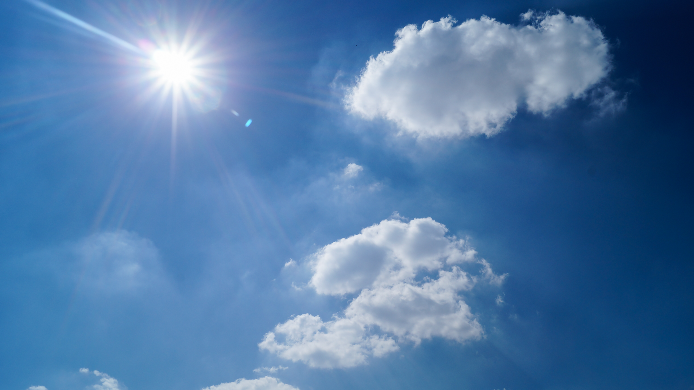

## Measurements of 8-B solar neutrinos

Sudbury Neutrino Observatory Collaboration (2001)

IMPRS seminar talk by Eduard Bopp (Dec 7, 2017)

### Nobel prize in physics 2015

SNO & Super-Kamiokande

---

### Quick recap: leptons & flavors

Three flavors: e, τ, μ

Neutrinos: $ν\_e$, $ν\_τ$, $ν\_μ$

### Homestake experiment

Count Argon atoms in $\mathrm{C}_2 \mathrm{Cl}_4$:

$$ ν_e + {}^{37}\mathrm{Cl} \to {}^{37}\mathrm{Ar} + e^- $$

Result: only 1/3 of expected flux

### What is the cause?

- Experimental error?
- Solar structure model?
- Standard model of particle physics?

### Neutrino oscillations

---

## Sudbury Neutrino Observatory

${}^8 B$ solar neutrinos

### Detection reactions

$ ν_e + d \to p + p + e^- $ (charged current; CC)

$ ν_x + d \to p + n + ν_x $ (neutral current; NC)

$ ν_x + e^- \to ν_x + e^- $ (elastic scattering; ES)

Note:

Heavy water core to measure CC and NC reactions

Charged particles cause Cherenkov radiation

Cherenkov detector

---

## Measurements

Data Overview

Calibration

Data reduction

Accuracy & resolution

Effective kinetic energy

Removal of radioactivity

---

## Results

### Angular distribution

### Energy distribution

Uncertainties

Neutrino flux measurements
put in results

Compare with high-precision Super-Kamiokande ES measurements

### Combined fluxes

---

### Summary
