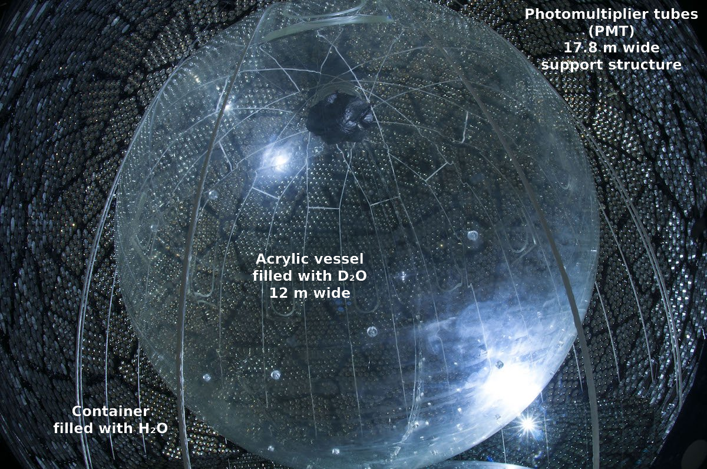

## Measurements of 8-B solar neutrinos

Sudbury Neutrino Observatory Collaboration (2001)

IMPRS seminar talk by Eduard Bopp (Dec 7, 2017)

### Nobel prize in physics 2015

Takaaki Kajita & Arthur McDonald

Super-Kamiokande & Sudbury Neutrino Observatory

---

### Quick recap: leptons & flavors

Three flavors: e, τ, μ <!-- .element: class="fragment" -->

Neutrinos: $ν\_e$, $ν\_τ$, $ν\_μ$ <!-- .element: class="fragment" -->

### Homestake experiment

$$ ν_e + {}^{37}\mathrm{Cl} \to {}^{37}\mathrm{Ar} + e^- $$

count Argon atoms in $\mathrm{C}_2 \mathrm{Cl}_4$

→ only 1/3 of expected flux

### What is the cause?

- Experimental error? <!-- .element: class="fragment" -->
- Solar structure model? <!-- .element: class="fragment" -->
- Standard model of particle physics? <!-- .element: class="fragment" -->

### Neutrino oscillations

Gribov & Pontecorvo (1969):

$$ \lvert ν\_α \rangle = \sum\_i U\_{αi}^* ν\_i $$

$$ \lvert ν\_i (L) \rangle = \exp ( -\frac{i m\_i^2 L}{2 E} ) \lvert ν\_i (0) \rangle $$

---

## Sudbury Neutrino Observatory

${}^8 B$ solar neutrinos

### Detection reactions

$ ν_e + d \to p + p + e^- $ (charged current; CC) <!-- .element: class="fragment" -->

$ ν_x + d \to p + n + ν_x $ (neutral current; NC) <!-- .element: class="fragment" -->

$ ν_x + e^- \to ν_x + e^- $ (elastic scattering; ES) <!-- .element: class="fragment" -->

Note:

elastic scattering is sensitive to all, but less to μ, τ

Note:

Heavy water core sensitive to reactions

Charged particles cause Cherenkov radiation

→ characteristic to reaction

Cherenkov detector: photomultiplier tubes

### Measurements

- Data taken over 240.95 days between Nov 2, 1999 – Jan 15, 2001
- Discard superfluous events
  - Electrical charges
  - Cosmic rays
  - γ-ray events

### Candidates

Note:

CC inside D2O

ES both inside & outside

contains neutron capture events

discard everything inside the dashed line

leave margin to acrylic vessel

---

## Results

### Angular distribution of CC events

Note:

reaction kinematics:

forward peak → elastic scattering

slope → charged current

### Energy distribution of CC events

Note:

no deviation of the shape from non-oscillation hypothesis

but: clearly lower than ES fluxes from Super-K

### Systematic error on fluxes

### Neutrino flux

$$\begin{eqnarray}
Φ^\mathrm{CC}\_\mathrm{SNO} (ν\_e) &=& 1.75 \pm 0.07 \mathrm{(stat.)}
{}^{+0.12}\_{-0.11} \mathrm{(sys.)}
\pm 0.05 \mathrm{(theo.)} \\\\
&&\times 10^6 \mathrm{cm}^{-2} \mathrm{s}^{-1} \\\\
Φ^\mathrm{ES}\_\mathrm{SNO} (ν\_x) &=& 2.39 \pm 0.34 \mathrm{(stat.)}
{}^{+0.16}\_{-0.14} \mathrm{(sys.)} \\\\
&&\times 10^6 \mathrm{cm}^{-2} \mathrm{s}^{-1}
\end{eqnarray}$$

only $1.6 σ$ <!-- .element: class="fragment" -->

### Compare with Super-Kamiokande

$$\begin{eqnarray}
Φ^\mathrm{ES}\_\mathrm{SK} (ν\_x) &=& 2.32 \pm 0.03 \mathrm{(stat.)}
{}^{+0.08}\_{-0.07} \mathrm{(sys.)} \\\\
&&\times 10^6 \mathrm{cm}^{-2} \mathrm{s}^{-1}
\end{eqnarray}$$

$3.3 σ$ difference between $Φ^\mathrm{ES}\_\mathrm{SK} (ν\_x)$ and
$Φ^\mathrm{CC}\_\mathrm{SNO} (ν\_e)$! <!-- .element: class="fragment" -->

### Combined fluxes

---

## Summary

- Astrophysics can help us learn about fundamental physics
- Interior processes of the sun are well understood
- Neutrinos can change their type in flight through oscillations

Sources:

- Ahmad et al./SNO collaboration (2001)
- John Bahcall: Solar Models: An Historal Overview (2003)
- John Bahcall: Solving the mystery of the missing neutrinos (2004)
- Illustrations: Wikipedia, SNO and Super-K
